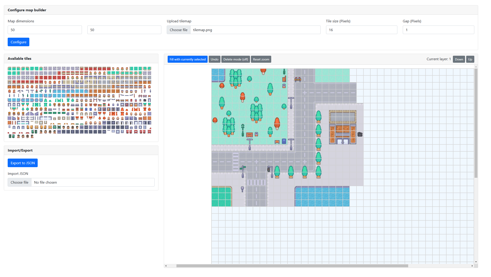

# Level Editor

This project is a Level Editor for creating and managing game levels.

## Features

- **Create New Levels**: Design levels from scratch.
- **Edit Existing Levels**: Modify and enhance your current levels.
- **Save and Load Levels**: Store your progress and continue later.
- **Export to JSON**: Share your levels in a universal format.

## Getting Started

To begin, open `index.html` in your web browser. This will launch the Level Editor interface.

## Usage

1. **Create a New Level**: Enter the desired map dimensions, upload a tilesheet, and specify the tile size. Click "Generate" to split the tilesheet into tiles.
2. **Edit Level**: Utilize the provided tools to add, remove, or modify elements within the level.
3. **Export Level**: Click the "Export" button to save the level in JSON format.
4. **Import Level**: Click the "Import" button to load a level from a JSON file.

## License

This project is licensed under the MIT License.
